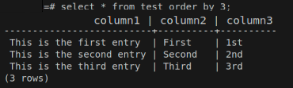
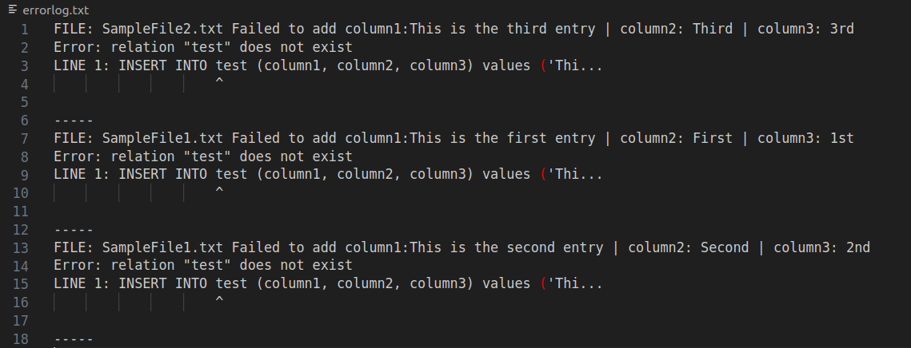

# Parse multiple files and upload to SQL database
### <em>Supplementary folder/file splitting script at bottom of readme...</em>

Here is a lightweight python program which you can customise for your own keyword search in text files held within a directory.

<em>I have processed 100,000+ files with this program to insert 6,500,000+ rows into a database with no issues.
I recommend if you are expecting to insert a huge amount of lines, that you upload to sql server/database on your machine (localhost), then carry out a database dump which you can restore to your desired server. This is only because it may be much quicker. Otherwise it will just take a long time depending on your connection and server transaction capacity.</em>

### Note the comments in the parse.py file. You must change according to your requirements.

You set the DIRECTORY in parse.py to location where all the text files are located which you want to process.
This program opens each file and looks for a particular keyword (keyword1) at the beginning of each line.
It then takes the content following the word on the line and stores it as a value. 
It then checks the following line.
If keyword2 is presence on next line, it will store the content following the keyword.
If the second keyword (keyword2) is NOT on the following line, an empty value is
stored. Same with keyword3.
You can choose to have as many or as few keywords as you like. The script comes with setup for 3 keywords.

After a file is processed, it is moved to a destination directory

Take a look at SampleFile2.txt in the provided test folder as an example. 


The program will look for keyword1, keyword2 and keyword3.


It will then attempt to insert into a new row in the database you nominate in the parse.py file.

REMEMBER TO ADJUST THE NUMBER OF KEYWORDS AS WELL AS DECLARE THEM WITH THE CORRECT COLUMN NAMES AS THE TABLE IN WHICH YOU WILL INSERT
e.g 
change Keyword1 = "Keyword1"
to     Keyword1 = "username"

On successful execution the table will be populated with all the rows in all the files which have the keyword1 satisfied at the 
beginning of the sentence. 



There are log files and messages printed during execution.

Successful processing


Error encountered, cannot move processed file to destination location


### PROCESSING DOES NOT MEAN SUCCESSFUL INSERTION INTO TABLE!!
<strong>Check the errorlog.txt. If an issue is encountered during insert to database, it is logged in errorlog.txt 
Errors can be anything from connection failure, to unsupported encoding encountered.  
A file called 'resubmit.txt' contains the data which was not able to be uploaded/inserted. It is in a format so that all 
you need to do after rectifying errors in the resubmit.txt file is move the resubmit.txt file in your DIRECTORY and rerun program</strong>

Sample content in 'errorlog.png



Sample content in 'resubmit.txt'


## Installation

- Edit parse.py when there is comments with your necessary changes and database configuration

- Ensure that the DIRECTORY and DESTINATIONS are correct

- Open terminal in the directory containing parse.py

- Enter the following in terminal
```
python3 parse.py
```

### Supplementary folder/file split script

The .sh file called split.sh is so you can split a folder containing large amounts of files into smaller subfolders.

Open the file and set your requirements i.e Source Directory, Destination Directory, Number of files per subfolder

Note: If destination directory has subfolders with name as Destination Prefix in script, the script will fail

- Open terminal in the directory containing split.sh

- Enter the following in terminal

```
./split.sh
```
